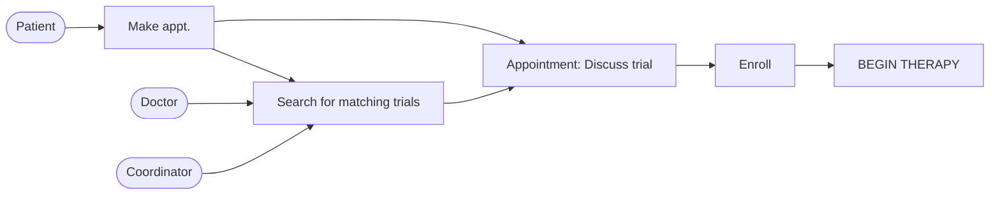
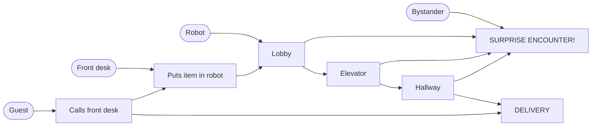
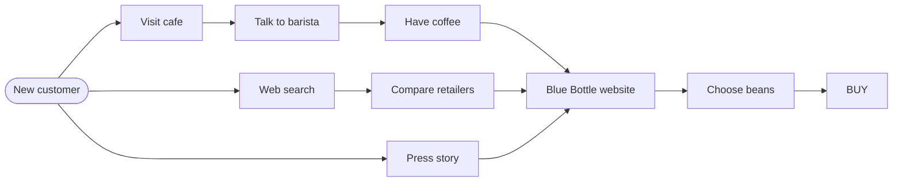

# Map

> Source: Knapp, J., Zeratsky, J., & Kowitz, B. (2016). *Sprint: How to Solve Big Problems and Test New Ideas in Just Five Days.* Simon & Schuster. Chapter: "Map."

## Introduction

The map you'll create on Monday is a simple diagram representing lots of complexity. Instead of elves and wizards moving through Middle Earth, your map will show customers moving through your service or product. Not quite as thrilling, but every bit as useful.

The map is a big deal throughout the week. At the end of the day on Monday, you'll use the map to narrow your broad challenge into a specific target for the sprint. Later in the week, the map will provide structure for your solution sketches and prototype. It helps you keep track of how everything fits together, and it eases the burden on each person's short-term memory.

No matter how complicated the business challenge, it can be mapped with a few words and a few arrows. Each map is customer-centric, with a list of key actors on the left. Each map is a story, with a beginning, a middle, and an end. And each map is simple — composed of nothing more than words, arrows, and a few boxes.

## Make a map

You'll draw the first draft of your map on Monday morning, as soon as you've written down your long-term goal and sprint questions. Use the same whiteboard you wrote your goal on and dive in. When we're drawing our maps, we follow these steps (keep in mind, there's a checklist at the back of the book, so you don't have to memorize this):

### 1. List the actors (on the left)

The "actors" are all the important characters in your story. Most often, they're different kinds of customers. Sometimes, people other than customers—say, your sales team or a government regulator—are important actors and should be listed as well. And sometimes, of course, there's a robot.

### 2. Write the ending (on the right)

It's usually a lot easier to figure out the end than the middle of the story. Flatiron's story ended with treatment. Savioke's story ended with a delivery. And Blue Bottle's story ended with buying coffee.

### 3. Words and arrows in between

The map should be functional, not a work of art. Words and arrows and the occasional box should be enough. No drawing expertise required.

### 4. Keep it simple

Your map should have from five to around fifteen steps. If there are more than twenty, it's probably too complicated. By keeping the map simple, the team can agree on the structure of the problem without getting tied up in competing solutions.

### 5. Ask for help

As you draw, you should keep asking the team, "Does this map look right?"

## Examples

Let's look at a couple more examples.

### Flatiron Health — clinical trial enrollment

Flatiron Health had a complicated problem and a straightforward map. Your map should be simple, too. You won't have to capture every detail and nuance. Instead, you'll just include the major steps required for customers to move from beginning to completion.

It was an intricate and messy system. But, after an hour of discussion and a lot of revision, we were able to create a simple map:

On the left was a list of the people involved in trial enrollment: the patient and the doctor (who were central to the treatment decision) and the clinic's research coordinator (who was easy to overlook but might be the best informed about trial availability). From there, the map showed the patient scheduling an appointment, the doctor and staff searching for matching trials, the appointment, the complete enrollment, and finally, the beginning of treatment.

Behind those few simple steps were all kinds of difficulties with the enrollment process: overworked staff, missing data, and communication gaps. As Amy had explained to us, many of the doctors who were supposed to suggest trials didn't even know which trials were open at their clinic.

### Savioke — robot delivery

Savioke had to organize information about robotics, navigation, hotel operations, and guest habits. This is their map:

### Blue Bottle Coffee — online sales

Blue Bottle Coffee sorted through information about coffee selection, customer support, café operations, and distribution channels. Here is their map:

