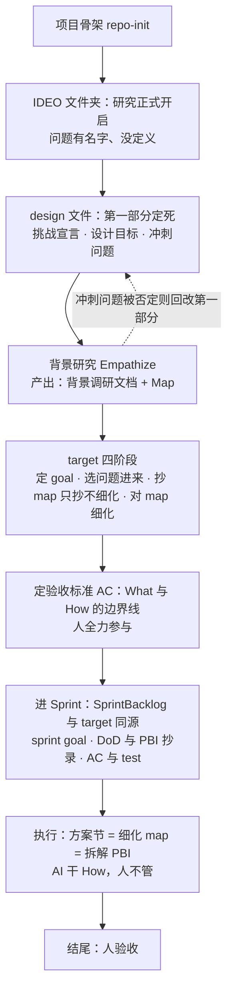

> 按 Scrum Guide Expanded v2026.1 的 Product / Increment / Product Backlog artifact 框架定义。
> Product Owner: SeaPawn
>
> 修订记录：2026-08-30 旧目标（design-kernel 与 scrum-kernel 结构对等）判定为方向性错误——以文档结构为终点而非产品价值，且未经 Design Sprint 验证即直接进入 Scrum（`scrum/` 中无初始验证记录）。v2.0.0 新轨重启；Sprint 01-05 作为历史保留，不再延续旧目标。同日：Architecture 节据验证轮客户之声落为草案（流程 mermaid 图 + What/How 边界原则，受未决清单约束）；删除「Review — 1.x 历史」节——教训已蒸馏至 `.claude/memory/`，原文 git 可查。**同日重整**：PBI 全删——[seapawn.md](../seapawn.md) 待办列表 19 条全数纳入为 PBI-12~17（六簇），废弃 PBI-7~11 与「PBI-7 前置 Design Sprint 验证轮」框架；未决事项不作前置表态，转为各 PBI 的「开放点」，执行中由 PO 与 developer 敲定；排序留待 Sprint Planning。

# Product Backlog

## Product

**IDEO-Scrum** 是一个 Claude Code marketplace 插件：将 Design Thinking 与 Scrum Sprint 两套方法论集成到 Claude Code，通过 skills、role agents、output-styles 提供结构化的方法论引导与流程框架。

**边界**：不做项目管理工具本身，不做 JIRA/Linear 集成，也不做团队协作平台——只提供方法论引导和流程框架。

## Product Vision

让 Claude Code 成为一个随身的设计思维与敏捷教练——有方法论需求的人打开 Claude Code 调用 IDEO-Scrum，就能获得结构化、忠于原文、可操作的方法论引导。

## Definition of Done

### Definition of Outcome Done

| 度量                                                                     | 目标信号       |
| ------------------------------------------------------------------------ | -------------- |
| 一次会话走通方法论环节：完整引导（结构化、忠于原文），≤2 轮对话进入执行 | 用户不反复追问 |

### Definition of Output Done

| 维度     | 标准                                                                                  |
| -------- | ------------------------------------------------------------------------------------- |
| 内容忠实 | 忠于源材料（SGEP / d.school / Sprint）；方法论设计部分（融合、solo+AI）标注来源与依据 |
| 可导航   | 从 SKILL.md 入口 ≤2 跳到达任意 reference / 角色 agent                                |
| 无死链   | 所有 markdown 内部链接可解析，无 404                                                  |

# Product Backlog Items

> **总目标（v2.0.0）**：实现 IDEO-Scrum v2.0.0——完成 v2.0.0 改进（双内核联动、角色体系重构、ideo 与 Design Sprint 融合、设计阶段快原则），并将本次开发的方法论感悟沉淀为随插件交付的背景文档。
>
> **概览**：本清单由 [seapawn.md](../seapawn.md) 待办列表 19 条于 2026-08-30 整理而来，**全数纳入、不遗漏**。下列簇序仅为枚举序，不是优先级——**Sprint 1 选材与排序由 PO 在 Sprint Planning 决定**。各 PBI 的「开放点」不在日志里表态，执行中由 PO 与 developer 敲定。1.x 的 PBI-1~6 与同日废弃的 PBI-7~11 见 git 历史。

## PBI 清单

| #      | 标题                                          | 意图                                                                                                                                               | 要点（seapawn.md）                                                                                                                                                                                                                                                                                                                                                           | 当前状态 | 备注（开放点，执行中敲定）                                                                                                                                                 |
| ------ | --------------------------------------------- | -------------------------------------------------------------------------------------------------------------------------------------------------- | ---------------------------------------------------------------------------------------------------------------------------------------------------------------------------------------------------------------------------------------------------------------------------------------------------------------------------------------------------------------------------- | -------- | -------------------------------------------------------------------------------------------------------------------------------------------------------------------------- |
| PBI-12 | 专家笔记完善——使用方法与感悟落盘（docs）    | [ExpertNotes.md](../docs/ExpertNotes.md) 完善为「作者如何使用本方法论」完整版：方法与手法已落盘，「我的感悟」一节待补                               | L3 将自己的感悟总结进一个笔记文件                                                                                                                                                                                                                                                                                                                                            | 待开始   | 感悟由作者口述、助手记录（分工同验证轮）                                                                                                                                   |
| PBI-13 | 角色体系——教学位与执行位                    | 角色分教学与执行两类：master 掌两个内核的教学，designer / developers 是执行核心；decider 消除、职能归 PO                                           | L4 developer 改为 developersL5 添加多角色、教学很重要、SM 更多属性L6 SM 升级为 master 掌两方面教学（提案）L17 用 SM×developers 关系跑 sprint（如 AC 验收），developers 可多人并行L18a 消除 decider、全部换成 PO                                                                                                                                                             | 待开始   | master 提案定案与否 + 护栏条款（教流程，不替 PO 排序、不替 dev 实现）；SM×developers 对抗 / 协作谁对谁（ExpertNotes 未决清单项）                                          |
| PBI-14 | 设计阶段快原则与 output-style 重构            | 设计阶段原则是快——快速、原型验证、不为正式结果；原型要有原型感而非真实现；故事讲出来即可；原则落进 designer，重构 output-styles                  | L7 design sprint 整体原则快快快L8 快速且原型验证、不是为了正式结果L9 原型必须有原型感、写进 designerL10b 不需要故事板、故事讲出来 user 懂即可L18b designer 风格重构 / 删除 / 换理论（三选一）；三种 output-style 都重构、最好直接抄书                                                                                                                                        | 待开始   | designer 三选一；「直接抄书」落法——红线：《Sprint》全版权仅可记方法流程、不得逐字大段，d.school 有 NC 限制（见[ATTRIBUTION.md](../ATTRIBUTION.md)）；三风格重构范围与顺序 |
| PBI-15 | ideo 与设计冲刺融合重构（scrum 技能同步重构） | ideo 深度重构，与设计冲刺直接融合为一个方法论（讲清设计冲刺是什么，五天法完全废弃）；scrum 技能重构至清晰可读、与 ideo 对齐；designsprint 删除融入 | L16 ideo 深度重构、融合设计冲刺、专门提设计冲刺是什么、五天法完全不用L19 scrum 技能重构清晰可读类似 ideo、designsprint 删掉融入 ideoL10a targetmap 定后：主 agent 收敛方案、子 agent 发散、方案汇总到 targetmap 第三节再正式原型L11 类似 SprintBacklog：planning 定 goal 和 map、developers 做方案……一条龙做完、完全同源L13 design 转 scrum 直接全部摘抄、摘不了的保持空集 | 待开始   | map 精化时机；target 落位（独立文件 or design 第三部分）；「选问题进来」的来源；「细化 PBI 供 LLM 理解」是否伪需求（均 ExpertNotes 未决清单项）                            |
| PBI-16 | 双内核联动——描述字段互链                    | 两个 kernel 互相指路：说清 ideo 预研究与 scrum 的紧密关系（scrum 前很多问题需 ideo 预研究出来），路标写进两个 skill 的描述字段                     | L12 联动原则；claude.md 注入查明不可→描述字段互链L14 自动优化两个 skill 描述字段（很重要）L15 说清 ideo 预研究→scrum 紧密关系：描述字段（+ claude.md 相关内容）常驻上下文                                                                                                                                                                                                  | 待开始   | L14「自动」形态（人工定期 vs 机制自动）；L15 的 claude.md 手段与 L12 已查明结论冲突，以何为准                                                                              |
| PBI-17 | 流程规格——review 产出与 map 归属            | review 的产出必须有明确规格，每次执行前写清楚；产品日志 review 节已删（2026-08-30 完成），内容按「附着进 map」处理                                 | L20 review 产出必须有规格、每次做都要明确L21 review 节删除（已完成）；回头直接附着在 map 当中去                                                                                                                                                                                                                                                                              | 待开始   | 「附着在 map」的确切含义（review 产出回写 map？）；review 产出规格的具体形态                                                                                               |

# Architecture

> 2026-08-30 据验证轮客户之声（[docs/ExpertNotes.md](../docs/ExpertNotes.md)）抽象为**草案**——开放点（map 精化时机、角色点名、target 落位等）已归入 PBI-13~15 的「开放点」，执行中敲定后修订；细节后面敲定。

一条「研究 → 实施」流水线：IDEO 侧开启研究（design 文件定死挑战 → 背景研究产出 Map）→ target 收敛（选问题、抄 map、**定验收标准**）→ 进 Sprint 执行（AI 干 How）→ 人验收。**验收标准（AC）是 What 与 How 的边界线**：人守 What（goal、question、DoD、map、PBI、AC），AI 干 How、人不管。target 与 SprintBacklog 同源同构（goal / 抄录 / AC / How / 验收一一对应，对照表见 ExpertNotes 第五节）。

<small>（原「Review — 1.x 历史」节，2026-08-30 删除）：Sprint 01-05 以 v1.0.2 收官，PBI-1~5 完成、PBI-6 并入 PBI-7（五天法废弃，骨架保留）。教训蒸馏于 （MEMORY.md 索引 + 五期档案）；Review 全文与 PBI 快照见 git 历史。旧 Product Goal（结构对等）判定方向性错误，见文档头修订记录。</small>
