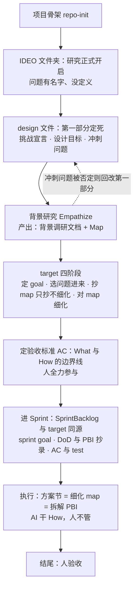

> 按 Scrum Guide Expanded v2026.1 的 Product / Increment / Product Backlog artifact 框架定义。
> Product Owner: SeaPawn
>
> 修订记录：2026-08-30 旧目标（design-kernel 与 scrum-kernel 结构对等）判定为方向性错误——以文档结构为终点而非产品价值，且未经 Design Sprint 验证即直接进入 Scrum（`scrum/` 中无初始验证记录）。v2.0.0 新轨重启；Sprint 01-05 作为历史保留，不再延续旧目标。同日：Architecture 节据验证轮客户之声落为草案（流程 mermaid 图 + What/How 边界原则，受未决清单约束）；删除「Review — 1.x 历史」节——教训已蒸馏至 `.claude/memory/`，原文 git 可查。**同日重整**：PBI 全删——[seapawn.md](../seapawn.md) 待办列表 19 条全数纳入为 PBI-12~17（六簇），废弃 PBI-7~11 与「PBI-7 前置 Design Sprint 验证轮」框架；未决事项不作前置表态，转为各 PBI 的「开放点」，执行中由 PO 与 developer 敲定；排序留待 Sprint Planning。同日 Sprint Planning：PO 口述新增 PBI-18（双内核执行模板，PO 定调"很重要"）；Sprint 06 立项，选材 PBI-13~18，SprintBacklog 见 [SprintBacklog.md](SprintBacklog.md)（分支 sprint-06-dual-kernel-refactor）。**2026-08-31 执行中协商**（作者重整待办迁至 [.claude/seapawn.md](../.claude/seapawn.md)，九条标记完成；对话确认）：**PBI-13 整体撤销**——developer 保持单数、不设 master、SM×developers 关系弃、scrum-kernel agents 六文件与 output-styles/designer.md 已删除（提交 8f62ced，validator PASS）；**PBI-14 重塑**——designer 复活重造为设计阶段专有风格（弃旧版「AI agent 设计师」定位），快原则收窄为「原型感+快速验证」写入 design-kernel 三处（describe/第一节/对应章节），设计冲刺整体原则不单列；**PBI-15 定案**——map 精化=方案节、targetmap=单一文档三节式、选问题=design 第一部分命中者、「细化 PBI 供 LLM 理解」=伪需求不采纳（Developer 代决、PO 可否决），decider 消除（职能归 PO）并入五天法清除；**PBI-16 定案**——描述字段一次性深度优化互链（「自动」否决），claude.md 注入以 L12 查明结论为准放弃；**PBI-17 泛化**——「关键文档与元件预先规格设计」，「附着进 map」闭合；PBI-18 不变。DoD「可导航」随之收窄（角色 agent 不复存在）。**2026-08-31 冲刺收官**：PO 定案——15-D（scrum 技能重构）、14-B（developer/scrum-master 重构）、17（预先规格）、18（模板）移出本冲刺、留待后续；15-4 两机制点（同源一条龙、摘抄边界）经 PO 定案不落文（定案存本日志）；PBI-16 关闭（双内核描述互链完成）；PBI-12 维持下一冲刺。插件发版 v2.0.0（plugin.json 与 README 两处同步、tag v2.0.0、合入 main 推送远端）。**2026-09-08（Sprint 06 延续）**：执行 seapawn.md L44——scrum-master output-style 去 coding 功能（frontmatter 移除 keep-coding-instructions，developer/designer 保留）、三 output-style（sm/developer/designer）全量英文化（译文经 PO 过目放行）；版本号 2.0.0→2.0.1（plugin.json 与 README 两处同步、tag v2.0.1、合入 main 推送远端）；PBI-14-B（抄书合规路径）仍留待后续冲刺、本次未涉。

# Product Backlog

## Product

**IDEO-Scrum** 是一个 Claude Code marketplace 插件：将 Design Thinking 与 Scrum Sprint 两套方法论集成到 Claude Code，通过 skills 和 output-styles 提供结构化的方法论引导与流程框架。

**边界**：不做项目管理工具本身，不做 JIRA/Linear 集成，也不做团队协作平台——只提供方法论引导和流程框架。

## Product Vision

让 Claude Code 成为一个随身的设计思维与敏捷教练——有方法论需求的人打开 Claude Code 调用 IDEO-Scrum，就能获得结构化、忠于原文、可操作的方法论引导。

## Definition of Done

### Definition of Outcome Done

| 度量                                                                     | 目标信号       |
| ------------------------------------------------------------------------ | -------------- |
| 一次会话走通方法论环节：完整引导（结构化、忠于原文），≤2 轮对话进入执行 | 用户不反复追问 |

### Definition of Output Done

| 维度     | 标准                                                                                  |
| -------- | ------------------------------------------------------------------------------------- |
| 内容忠实 | 忠于源材料（SGEP / d.school / Sprint）；方法论设计部分（融合、solo+AI）标注来源与依据 |
| 可导航   | 从 SKILL.md 入口 ≤2 跳到达任意 reference                                            |
| 无死链   | 所有 markdown 内部链接可解析，无 404                                                  |

# Product Backlog Items

> **总目标（v2.0.0）**：实现 IDEO-Scrum v2.0.0——完成 v2.0.0 改进（双内核联动、角色体系重构、ideo 与 Design Sprint 融合、设计阶段快原则），并将本次开发的方法论感悟沉淀为随插件交付的背景文档。
>
> **概览**：本清单由 [seapawn.md](../.claude/seapawn.md) 待办列表整理而来（2026-08-30 初稿 19 条全数纳入；2026-08-31 作者重整收敛并随执行协商修订）。下列簇序仅为枚举序，不是优先级——**Sprint 1 选材与排序由 PO 在 Sprint Planning 决定**。各 PBI 的「开放点」不在日志里表态，执行中由 PO 与 developer 敲定。1.x 的 PBI-1~6 与同日废弃的 PBI-7~11 见 git 历史。

## PBI 清单

| #      | 标题                                          | 意图                                                                                                                                               | 要点（seapawn.md）                                                                                                                                                                                                                                                                                                                                                           | 当前状态 | 备注（开放点，执行中敲定）                                                                                                                                                 |
| ------ | --------------------------------------------- | -------------------------------------------------------------------------------------------------------------------------------------------------- | ---------------------------------------------------------------------------------------------------------------------------------------------------------------------------------------------------------------------------------------------------------------------------------------------------------------------------------------------------------------------------- | -------- | -------------------------------------------------------------------------------------------------------------------------------------------------------------------------- |
| PBI-12 | 专家笔记完善——使用方法与感悟落盘（docs）    | [ExpertNotes.md](../docs/ExpertNotes.md) 完善为「作者如何使用本方法论」完整版：方法与手法已落盘，「我的感悟」一节待补                               | L3 将自己的感悟总结进一个笔记文件                                                                                                                                                                                                                                                                                                                                            | 待开始   | 感悟由作者口述、助手记录（分工同验证轮）                                                                                                                                   |
| PBI-13 | 角色体系——教学位与执行位                    | 角色分教学与执行两类：master 掌两个内核的教学，designer / developers 是执行核心；decider 消除、职能归 PO                                           | L4 developer 改为 developersL5 添加多角色、教学很重要、SM 更多属性L6 SM 升级为 master 掌两方面教学（提案）L17 用 SM×developers 关系跑 sprint（如 AC 验收），developers 可多人并行L18a 消除 decider、全部换成 PO                                                                                                                                                             | 已撤销 2026-08-31 | 定案：developer 保持单数、不设 master、SM×developers 弃、agents/ 已删除；decider 消除归 PBI-15（见修订记录）                                          |
| PBI-14 | 设计阶段快原则与 output-style 重构            | 原型要有原型感、快速验证而非正式结果——写入 design-kernel 三处（describe / 第一节 / 对应章节）；designer 复活重造为设计阶段专有风格；三种 output-styles 全部重构                  | L9 原型必须要有原型感，而不是真正的实现 L8 快速且原型验证、不为了正式结果（设计冲刺整体原则不需要专门说，主要是原型快速验证）——写入 skill 的 describe + 第一节 + 对应章节 L18 尾注：ideo 阶段 PO 一般和团队成员一起完成，搞一个 designer 还是比较好——重造 designer（弃旧版「AI agent 设计师」定位） L18 三种 output-style 都重构、最好直接抄书                                                                                                                                        | 进行中（14-1/2/4 + 14-A 完成，余 14-B） | 三选一已定（2026-08-31）：删除后复活重造，新定位=设计阶段专有结对风格（skill 讲原则方法、designer 承载人格与引导）；14-A 已落（2026-08-31，plan v3 经 PO 三轮反馈 + PO 手工精简）：旧稿为底重造、原型原则成节（初为三条，「原型即提问」经 PO 手工删，现两条）、「学习速度优先/故事讲出来」两条与交棒节经 PO 判定删除；「直接抄书」红线：《Sprint》全版权仅可记方法流程、不得逐字大段，d.school 有 NC 限制（见[ATTRIBUTION.md](../ATTRIBUTION.md)） |
| PBI-15 | ideo 与设计冲刺融合重构（scrum 技能同步重构） | ideo 深度重构，与设计冲刺直接融合为一个方法论（讲清设计冲刺是什么，五天法完全废弃）；scrum 技能重构至清晰可读、与 ideo 对齐；designsprint 删除融入 | L16 ideo 深度重构、融合设计冲刺、专门提设计冲刺是什么、五天法完全不用 L19 scrum 技能重构清晰可读类似 ideo L10a targetmap 定后：主 agent 收敛方案、子 agent 发散、方案汇总到 targetmap 第三节再正式原型（定案） L11 planning 定 goal 和 map、developers 做方案……一条龙做完、完全同源（定案） L13 design 转 scrum 直接全部摘抄、摘不了的保持空集（定案） | 进行中（15-B/15-C 完成，余 15-D） | 四开放点已定案（2026-08-31，Developer 代决、PO 可否决）：map 精化=发生在方案节（target 只抄不细化）；targetmap=单一文档三节式（goal/选问题、map 抄录、方案）；选问题=从 design 第一部分冲刺问题命中此 target 者选入；「细化 PBI 供 LLM 理解」=伪需求、不采纳（LLM 当场理解、不懂就追问，细化属方案节）。decider 消除（职能归 PO）并入五天法清除。2026-08-31 手术定案：DesignSprint/ 整删（五件参考迁 IDEO-modes/、design-sprint.md 并入 SKILL.md 五阶段表、how-might-we.md 删）；主收敛/子发散机制经 PO 决定删除（不重要，日后自行安排）；decider 全插件统一改 Product Owner                            |
| PBI-16 | 双内核联动——描述字段互链                    | 两个 kernel 互相指路：说清 ideo 预研究与 scrum 的紧密关系（scrum 前很多问题需 ideo 预研究出来），路标写进两个 skill 的描述字段                     | L12 联动原则；claude.md 注入查明不可→描述字段互链 L14 深度优化两个 skill 描述字段（很重要；作者 2026-08-31 由「自动」改「深度」——一次性优化） L15 说清 ideo 预研究→scrum 紧密关系：描述字段承载（claude.md 注入按 L12 结论放弃）                                                                                                                                                                                                  | 完成（2026-08-31） | 已定案（2026-08-31）：一次性深度优化（作者由「自动」改「深度」）；claude.md 手段放弃，以 L12 查明结论为准——描述字段为唯一载体                                                                              |
| PBI-17 | 流程规格——关键文档与元件的预先规格设计            | 每个关键文档、关键元件都要有预先规格设计，每次执行前写清楚（review 产出规格为其中一例）；与 PBI-18 模板同簇执行                                 | L20（2026-08-31 作者泛化）：每个关键文档以及关键元件，都要有预先规格设计，我认为很重要。比如 review 的产出，也必须有规格的，这个每次做都要明确 L21 review 节删除已完成、「附着进 map」已闭合（作者标记完成不再展开）                                                                                                                                                                                                                                                                              | 留待后续冲刺 | 规格清单（哪些文档/元件需要预先规格）与 PBI-18 模板清单一并敲定；review 产出规格为第一份落地规格                                                                                               |
| PBI-18 | 双内核执行模板——设计冲刺与 Scrum 配套模板 | 为设计冲刺与 Scrum 各设计配套执行模板（文件工件）：人持模板走流程、填 What，AI 填 How；模板要好好设计，是 skill 深度重构的一部分，显式引入人的因素 | 模板对设计冲刺与 Scrum 都要有；模板=skill 的载体；加入人的因素，人深度参与（PO 2026-08-30 Sprint Planning 口述） | 留待后续冲刺 | 模板清单（design / target / map / SprintBacklog 等各需哪些）；形态（markdown 骨架+填写指引？）；与 skill 的接线方式；与 ExpertNotes 同源结构（goal/抄录/AC/How/验收）的对应 |

# Architecture

> 2026-08-30 据验证轮客户之声（[docs/ExpertNotes.md](../docs/ExpertNotes.md)）抽象为**草案**——开放点（map 精化时机、角色点名、target 落位等）已归入 PBI-13~15 的「开放点」，执行中敲定后修订；细节后面敲定。

一条「研究 → 实施」流水线：IDEO 侧开启研究（design 文件定死挑战 → 背景研究产出 Map）→ target 收敛（选问题、抄 map、**定验收标准**）→ 进 Sprint 执行（AI 干 How）→ 人验收。**验收标准（AC）是 What 与 How 的边界线**：人守 What（goal、question、DoD、map、PBI、AC），AI 干 How、人不管。target 与 SprintBacklog 同源同构（goal / 抄录 / AC / How / 验收一一对应，对照表见 ExpertNotes 第五节）。

<small>（原「Review — 1.x 历史」节，2026-08-30 删除）：Sprint 01-05 以 v1.0.2 收官，PBI-1~5 完成、PBI-6 并入 PBI-7（五天法废弃，骨架保留）。教训蒸馏于 （MEMORY.md 索引 + 五期档案）；Review 全文与 PBI 快照见 git 历史。旧 Product Goal（结构对等）判定方向性错误，见文档头修订记录。</small>
