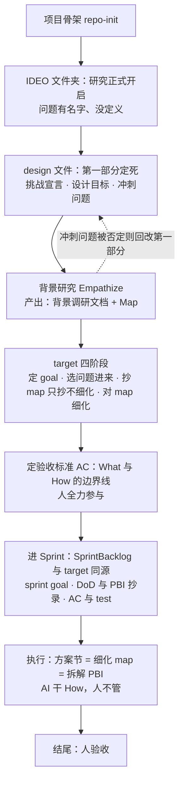

> 按 Scrum Guide Expanded v2026.1 的 Product / Increment / Product Backlog artifact 框架定义。
> Product Owner: SeaPawn
>
> 修订记录：2026-08-30 旧目标（design-kernel 与 scrum-kernel 结构对等）判定为方向性错误——以文档结构为终点而非产品价值，且未经 Design Sprint 验证即直接进入 Scrum（`scrum/` 中无初始验证记录）。v2.0.0 新轨重启；Sprint 01-05 作为历史保留，不再延续旧目标。同日：Architecture 节据验证轮客户之声落为草案（流程 mermaid 图 + What/How 边界原则，受未决清单约束）；删除「Review — 1.x 历史」节——教训已蒸馏至 `.claude/memory/`，原文 git 可查。

# Product Backlog

## Product

**IDEO-Scrum** 是一个 Claude Code marketplace 插件：将 Design Thinking 与 Scrum Sprint 两套方法论集成到 Claude Code，通过 skills、role agents、output-styles 提供结构化的方法论引导与流程框架。

**边界**：不做项目管理工具本身，不做 JIRA/Linear 集成，也不做团队协作平台——只提供方法论引导和流程框架。

## Product Vision

让 Claude Code 成为一个随身的设计思维与敏捷教练——有方法论需求的人打开 Claude Code 调用 IDEO-Scrum，就能获得结构化、忠于原文、可操作的方法论引导。

## Definition of Done（草案：经 Design Sprint 验证轮后定稿）

### Definition of Outcome Done

| 度量 | 目标信号 |
|---|---|
| 一次会话走通方法论环节：完整引导（结构化、忠于原文），≤2 轮对话进入执行 | 用户不反复追问 |

### Definition of Output Done

| 维度 | 标准 |
|---|---|
| 内容忠实 | 忠于源材料（SGEP / d.school / Sprint）；方法论设计部分（融合、solo+AI）标注来源与依据 |
| 可导航 | 从 SKILL.md 入口 ≤2 跳到达任意 reference / 角色 agent |
| 无死链 | 所有 markdown 内部链接可解析，无 404 |

# Product Backlog Items

> **总目标（v2.0.0）**：实现 IDEO-Scrum v2.0.0——完成 v2.0.0 改进（双内核联动、角色体系重构、ideo 与 Design Sprint 融合），并将本次开发的方法论感悟沉淀为随插件交付的背景文档。
>
> **概览**：本清单为 v2.0.0 新轨 PBI 序列（草案）。设计阶段（PBI-7）先过 Design Sprint 验证轮；1.x 的 PBI-1~5 已完成、PBI-6 已并入 PBI-7，处置详情见 git 历史（原「Review — 1.x 历史」节已删，教训蒸馏于 `.claude/memory/`）。

## v2.0.0 PBI 序列（草案）

> 前置（非 PBI）：PBI-7 的融合设计先过一轮 **Design Sprint 验证轮**（IDEO 阶段），验证结论作为其 AC 输入。

| # | 标题 | 用户故事 | 产品定位 | 当前状态 | 备注 |
|---|---|---|---|---|---|
| PBI-7 | ideo 与 Design Sprint 融合重构 | 作为 IDEO-Scrum 用户，我希望 ideo 与 Design Sprint 合一：sprint 是一次性的快速验证流程，而不是按五天法算日程——这样设计阶段真正跑得快 | 产品内核：v2.0.0 地基 | 待开始 | 吸收 PBI-5/6；AC 以验证轮结论为准 |
| PBI-8 | 角色体系重构 | 作为 IDEO-Scrum 用户，我希望角色分成教学（master）与执行（designer/developers）两类、执行可多人并行——一个人干团队的事，有教练带着 | 使用体验层：人格化指导 | 待开始 | developer→developers；master ≠ Scrum Guide SM（canonical agent 保留）；SM×developers AC 流程 |
| PBI-9 | 双内核联动 | 作为 IDEO-Scrum 用户，我希望从设计转 Scrum 时两个 kernel 互相指路——知道研究做完该进实施 | 价值主张层：研究→实施一条链 | 待开始 | 描述字段互链 + SKILL.md 关系章节；已查明 CLAUDE.md 注入不可行 |
| PBI-10 | designer output-style 重写 | 作为 IDEO-Scrum 用户，我希望设计模式真的"快"：原型有原型感、故事口述即可、不做真实现 | 教学层：风格即方法论 | 待开始 | 快快快 / 原型感 / 故事板口述化 |
| PBI-11 | 方法论感悟背景文档 | 作为作者，我希望把 1.x 的教训（目标错了一期）与五个 Sprint 的复盘写下来，作为背景交付 | 交付物：随插件交付 | 待开始 | 建议尽早（记忆新鲜、不阻塞重构） |
| PBI-6 | Design Sprint Tuesday-Friday 细化——solo + AI 方法论设计 | 作为 IDEO-Scrum 的 solo 用户，我需要 Monday 问题定义之后有一套单人 + AI 可执行的后续流程 | 旧范围：被 PBI-7 吸收 | 已并入 | 五天法废弃；骨架保留、肉身替换的设计已并入 PBI-7（融合重构） |

# Architecture

> 2026-08-30 据验证轮客户之声（[docs/ExpertNotes.md](../docs/ExpertNotes.md)）抽象为**草案**——受未决清单约束（map 精化时机、角色点名、target 落位等），随 PBI-7 推进修订；细节后面敲定。

一条「研究 → 实施」流水线：IDEO 侧开启研究（design 文件定死挑战 → 背景研究产出 Map）→ target 收敛（选问题、抄 map、**定验收标准**）→ 进 Sprint 执行（AI 干 How）→ 人验收。**验收标准（AC）是 What 与 How 的边界线**：人守 What（goal、question、DoD、map、PBI、AC），AI 干 How、人不管。target 与 SprintBacklog 同源同构（goal / 抄录 / AC / How / 验收一一对应，对照表见 ExpertNotes 第五节）。

<small>**1.x 历史存档**（原「Review — 1.x 历史」节，2026-08-30 删除）：Sprint 01-05 以 v1.0.2 收官，PBI-1~5 完成、PBI-6 并入 PBI-7（五天法废弃，骨架保留）。教训蒸馏于 `.claude/memory/`（MEMORY.md 索引 + 五期档案）；Review 全文与 PBI 快照见 git 历史。旧 Product Goal（结构对等）判定方向性错误，见文档头修订记录。</small>
